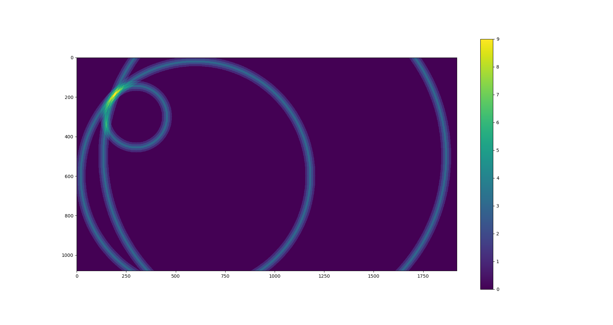

# trilaterationBasedOdometry

## Overview
In the course of my various work experiences and personal project ideations, I 
have found myself stumbling on the same issue - how do you **precisely** localize 
an object with respect to some known origin?

It is not a novel question and there exist many approaches - Simultaneous 
Localization and Mapping (SLAM), motion capture, UWB, and bluetooth triangulation 
for indoor environments, and differential GPS and radio beacons for outdoor environments. 
(Among other technologies)

However, the variance in precision, accuracy, cost, and robustness of existing 
technologies mean that autonomous vehicles still struggle to localize themselves 
in snowy environments, and drones still struggle to localize effectively in 
GPS-denied war zones, or 3+ stories below ground.

Could there be a better solution?

Yes. And it may already exist. But for the sake of educating myself and developing 
my abilities, I wanted to develop my own solution. In specific, I want to develop a
way to precisely localize objects or vehicles in outdoor, GPS-denied environments.

I introduce to you an alternate method of deriving the odometry of an object of 
known size via monocular camera-based trilateration.

## Installation
This project was designed to function as a containerized repository for the ease
of deployment. If I can ever get my engineering assignments done quickly enough to
lend me the time I need, the associated Docker Image will be available upon completion
of the project. 

## Design Choice and Methodology
Presented as a series of 'Frequently Asked Questions' (that nobody has asked me 
except myself).

### Why monocular cameras?
The full scale project consists of two parts: 
1. radio beacon hardware that can determine the distance between a server and 
   a client beacon
2. a simple software stack that can take the positions of the beacons, and their
   known distances to the object

I decided to tackle number 2 first, which means that I needed to substitute 
alternate hardware in place of number 1 in order to develop the software stack. 

So no, the full project does not entail the seemingly clumsy, arbitrary choice of
using monocular cameras for distance estimation. They are simply a placeholder
and have been treated as such. 

### So how does it work?
I will explain the operation of the monocular camera system, which requires that
the object of interest has a known size.
1. First, we place all beacons and ensure that they can communicate with the ROS
   master (the host laptop).
2. Next, we record the exact location of each camera cameras so that they can be localized
   on the system's internal map.
   1. This is done by taking an image of the scene from above, and pinpointing where
   the cameras are on the scene. 
3. Then, the host computer will request each camera to give it's distance from the
   object.
   1. For the camera-based setup, I draw a bounding box around the object. Because
   the object size is known, I can use some math to estimate the distance that
   the object is from the camera.
   2. The most practical approach to generate bounding boxes would be to use a
   simple neural network. For the sake of time, 

### Does your system have any advantages over traditional methods?
It would be bold to say so. I will just point out some 'pros' I can see with my 
system:
* Because we are using trilateration, we only need to know the position of the b
  beacons or cameras in use, not their orientation, etc.
* Monocular cameras are inexpensive.

### So why did you use <INSERT_NOUN_HERE>?
Some of my goals with this project include:
1. To gain further proficiency with Docker
2. To gain exposure to ROS 2
3. To deepen my understanding of how neural networks operate
   
Therefore, I chose the develop with the tools that I did, in the way that I did,
with the following in mind:
* I have a limited budget ($0.00 CAD)
* I have limited free time (some would argue it would have a negative value) 
* I set the goals mentioned above

I completed my project in iteratively more complex modules. These modules were as follows:
1. Get face measurement detection working
2. Train a pytorch model on my drone using what I learned in 1.
3. Create a ROS2 container and run 2. from it
4. Create a package in my container that allows me to move a point around in RVIZ based on keyboard input
5. ???
6. Replace my pytorch model with a homemade tensorflow lite model

## Future Work
- [ ] Utilizing a kalman filter on all incoming sensor data
- [ ] Developing the hardware needed to replace my cameras with radio beacons
- [ ] Adding additional cameras to provide a z axis estimation as well (3D instead
  of 2D)